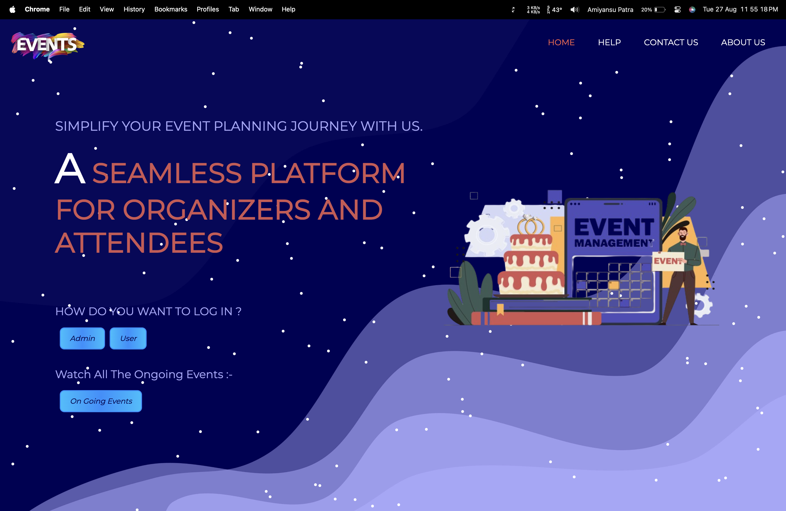
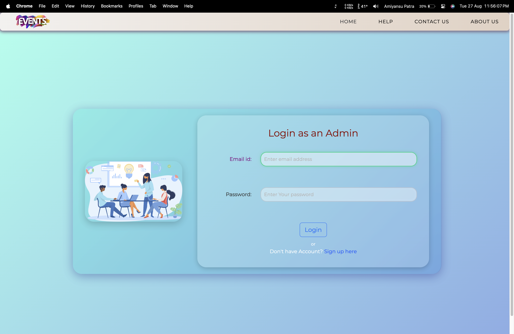

# Event Management System (MERN Stack)

    
        This is a fully functional <strong>Event Management System</strong> designed specifically for NGOs, built using
        the MERN stack. It allows NGOs to manage events, view upcoming and previous events, and update their profile
        information.
  

        
        
    

    <h2>Project Overview</h2>

    The system consists of two main components
 frontend: Built with React.js, utilizing Material UI, Ant Design, and Bootstrap for
            styling, alongside Google Maps integration for event locations.
       Backend: Powered by Node.js and Express, with MongoDB as the database to store event
            details and user information.

    <h2>Key Features</h2>
    
User Authentication: Login and registration system for NGOs using JWT for secure
            authentication.
        Event Management: Add, view, and update events for your NGO.
        Previous and Upcoming Events:</strong> View past events and current/upcoming events categorized
            separately.
        Google Maps Integration:</strong> Shows event locations on Google Maps.
        File Uploads:</strong> Allows users to upload images and files using Multer.
        Data Validation:</strong> Ensures data integrity and security with Validator.
        Responsive UI:</strong> Fully responsive UI built with Material UI, Ant Design, and Bootstrap.
       

    <h2>Project Structure</h2>

    <h3>Frontend</h3>

`
    React.js: Used for building the user interface.
       Ant Design, Material UI, Bootstrap:</strong> Provides a modern, responsive design for various
            components.
       Axios: For making HTTP requests to the backend.
        Google Maps API:</strong> Integrated for displaying event locations on the map.
    

    <h4>Key Dependencies:</h4>
    <pre>
<code>
{
  "@ant-design/icons": "^4.7.0",
  "@mui/material": "^5.4.4",
  "@react-google-maps/api": "^2.8.1",
  "axios": "^0.25.0",
  "bootstrap": "^5.1.3",
  "dotenv": "^16.0.0",
  "react": "^18.3.1",
  "react-bootstrap": "^2.1.2",
  "react-router-dom": "^5.3.0",
  "validator": "^13.7.0"
}
</code>
</pre>
`
    <h3>Backend</h3>
    Express.js:</strong> Backend server handling API requests.
        MongoDB:</strong> NoSQL database to store event data and user information.
        JWT:</strong> Used for user authentication and maintaining sessions.
       Multer:Middleware for handling file uploads.
    

    <h4>Key Dependencies:</h4>
    <pre>
<code>
{
  "bcrypt": "^5.0.1",
  "body-parser": "^1.19.2",
  "cors": "^2.8.5",
  "dotenv": "^16.0.0",
  "express": "^4.17.2",
  "jsonwebtoken": "^8.5.1",
  "mongoose": "^6.2.0",
  "multer": "^1.4.4"
}
</code>
</pre>
`
    <h2>Installation</h2>

    To run this project locally, follow these steps:

    <h3>Prerequisites</h3>
    
       Node.js
       MongoDB
       npm (Node Package Manager)
   
`
    Frontend Setup
    Navigate to the frontendfolder.
        Install the dependencies:
            npm install
        Start the frontend server:
            npm start

    <h3>Backend Setup</h3>
    
       Navigate to the folder.
        Install the dependencies:
            run npm install
        
        Set up your environment variables in a.env file (e.g., MongoDB URI, JWT Secret).
        Start the backend server:
            run npm start
        

    <h2>Environment Variables</h2>

   Create a <code>.env</code> file in your backend root directory and add the following:
    <pre>
<code>
MONGO_URI=your_mongodb_connection_string
JWT_SECRET=your_jwt_secret
PORT=9002
</code>
</pre>
    

    <h2>License</h2>

    This project is licensed under the MIT License - see the <a href="LICENSE">LICENSE</a> file for details.

    <h2>Author</h2>
`
    <h2>Amiyansu Patra</h2>

    
Feel free to reach out with any questions or suggestions!

